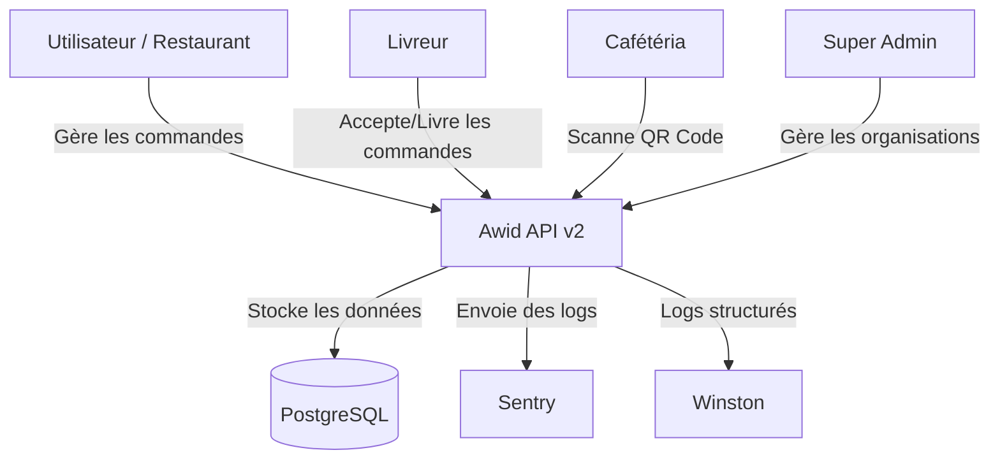

# Architecture du Projet Awid v2

Ce document décrit l'architecture de la solution de gestion de livraison B2B **Awid**.

## Vue d'ensemble (C4 Level 1: System Context)

Le système Awid permet aux organisations (restaurants) de gérer leurs commandes et livraisons, aux livreurs de recevoir leurs missions, et aux cafés de scanner les QR codes.



## Structure des Conteneurs (C4 Level 2: Container)

### Backend (Node.js / Express)
L'API REST est structurée en couches (Controller-Service-Repository pattern simplifié) :

```mermaid
graph TD
    subgraph "API v2"
        Router[Express Router] --> Middleware[Middleware (Auth, Validation, RateLimit)]
        Middleware --> Controllers[Route Handlers]
        Controllers --> Services[Business Logic]
        Services --> DB_Config[Database Pool (pg)]
    end
    DB_Config --> Database[(PostgreSQL)]
```

### Mobile App (Flutter)
Application multi-rôle (Admin, Livreur, Cafétéria) communiquant avec l'API.

- **State Management**: Provider
- **Architecture**: MVVM (Model-View-ViewModel)
- **Dependencies**: `http` (API), `flutter_secure_storage` (Token), `qr_code_scanner`

## Base de Données (Schema Simplifié)

- **organizations**: Multi-tenant isolation (Restaurants)
- **users**: Authentification et rôles (admin, deliverer, cafeteria)
- **products**: Catalogue des articles
- **orders**: Commandes principales
- **order_items**: Détail des commandes (Liaison produit)
- **deliveries**: Suivi de livraison (Assignation livreur)

## Flux de Données Principal : Commande

1. **Création**: `POST /orders` (Admin RESTO)
2. **Assignation**: `POST /deliveries/assign` (Admin RESTO) -> Notification Livreur
3. **Prise en charge**: Livreur accepte (`PATCH /deliveries/:id/status` -> `in_progress`)
4. **Livraison**: Livreur arrive, QR Code généré
5. **Validation**: Cafétéria scanne QR Code (`POST /deliveries/validate`)
6. **Clôture**: Commande marquée `delivered`.

## Sécurité

- **Authentification**: JWT (Access Token 15min / Refresh Token 7j)
- **Rate Limiting**: Protection contre le bruteforce (Login) et DDoS (Global)
- **Protection**: Helmet (Headers HTTP), CORS strict, Entrées validées par Zod
- **Audit**: Table `audit_logs` pour traçabilité des actions sensibles
