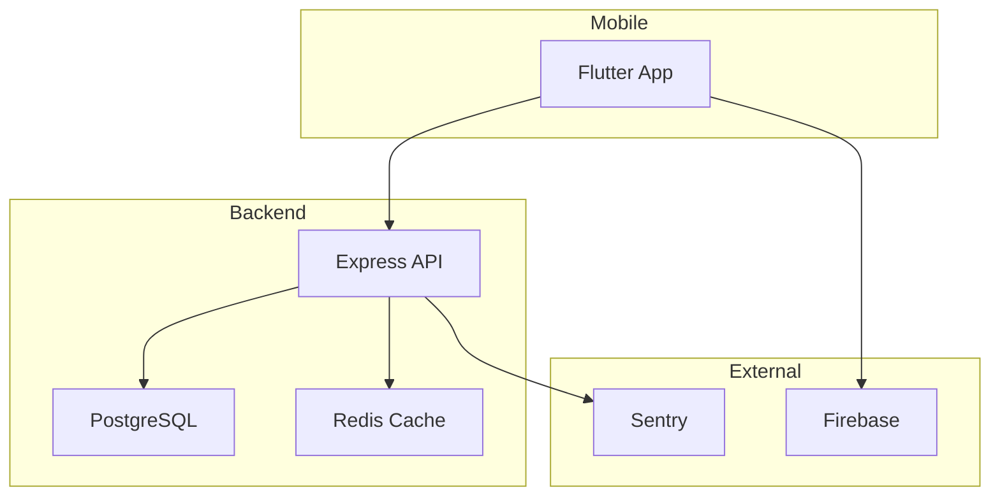
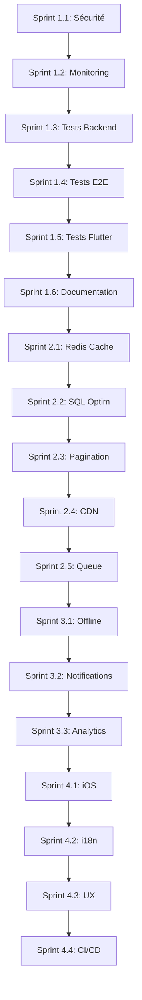

# 📋 PROMPTS STANDARDISÉS - PLAN AWID v2.0

## Guide d'utilisation

Chaque prompt suit une structure identique pour garantir la cohérence :

1. **CONTEXTE** - Rappel du projet et de l'état actuel
2. **OBJECTIF DU SPRINT** - Ce qui doit être accompli
3. **CONTRAINTES TECHNIQUES** - Stack, conventions, dépendances
4. **TÂCHES DÉTAILLÉES** - Liste précise avec critères d'acceptation
5. **LIVRABLES ATTENDUS** - Fichiers et résultats concrets
6. **RÈGLES DE QUALITÉ** - Standards à respecter
7. **VALIDATION** - Comment vérifier que c'est terminé

---

# 🎯 PHASE 1 : FONDATIONS (Semaines 1-8)

---

## SPRINT 1.1 : SÉCURITÉ (Semaine 1)

```markdown
## CONTEXTE PROJET

Tu travailles sur **AWID** (Application de gestion de livraison B2B).

**Stack technique :**
- Backend : Node.js + Express.js (dossier `api-v2/`)
- Base de données : PostgreSQL (hébergé sur Supabase/Neon)
- Mobile : Flutter (dossier `mobile/`)
- Hébergement : Vercel (backend) + Play Store (mobile)

**Structure actuelle :**
```
awid/
├── api-v2/
│   ├── config/
│   │   ├── cors.js
│   │   └── database.js
│   ├── routes/
│   │   ├── deliveries.routes.js
│   │   └── superAdmin.routes.js
│   ├── middleware/
│   └── services/
└── mobile/
```

**État actuel :** Application fonctionnelle v1.0, mais avec des failles de sécurité identifiées.

---

## OBJECTIF DU SPRINT

Corriger les vulnérabilités de sécurité critiques pour sécuriser l'application avant la mise en production.

**Durée :** 5 jours (40h)

---

## CONTRAINTES TECHNIQUES

- Ne PAS casser les fonctionnalités existantes
- Maintenir la rétrocompatibilité des APIs
- Documenter tout changement de configuration
- Tester chaque correction avant commit

---

## TÂCHES DÉTAILLÉES

### 1. Corriger CORS (api-v2/config/cors.js)

**Problème :** CORS trop permissif (wildcard ou domaines non contrôlés).

**Action requise :**
- Créer une whitelist explicite des domaines autorisés
- Différencier les environnements (dev/staging/prod)
- Bloquer les requêtes de domaines non autorisés

**Critères d'acceptation :**
- [ ] Whitelist contient uniquement les domaines légitimes
- [ ] Variables d'environnement utilisées (ALLOWED_ORIGINS)
- [ ] Requêtes depuis domaines non autorisés = erreur 403

**Exemple de code attendu :**
```javascript
const allowedOrigins = process.env.ALLOWED_ORIGINS?.split(',') || [];

const corsOptions = {
  origin: (origin, callback) => {
    if (!origin || allowedOrigins.includes(origin)) {
      callback(null, true);
    } else {
      callback(new Error('Not allowed by CORS'));
    }
  },
  credentials: true,
  methods: ['GET', 'POST', 'PUT', 'DELETE', 'PATCH'],
  allowedHeaders: ['Content-Type', 'Authorization']
};
```

---

### 2. Fixer SSL PostgreSQL (api-v2/config/database.js)

**Problème :** Connexion SSL non vérifiée (rejectUnauthorized: false).

**Action requise :**
- Activer la vérification du certificat CA
- Configurer le certificat SSL de Supabase/Neon
- Tester la connexion sécurisée

**Critères d'acceptation :**
- [ ] `rejectUnauthorized: true` en production
- [ ] Certificat CA configuré via variable d'environnement
- [ ] Connexion DB fonctionne avec SSL vérifié

---

### 3. Ajouter filtre organization_id sur location_history

**Problème :** Fuite de données inter-organisations possible.

**Action requise :**
- Vérifier que toutes les requêtes sur `location_history` filtrent par `organization_id`
- Ajouter middleware de validation si nécessaire
- Auditer toutes les routes utilisant cette table

**Critères d'acceptation :**
- [ ] Aucune requête ne retourne des données d'autres organisations
- [ ] Tests de sécurité ajoutés
- [ ] Middleware `enforceOrganizationScope` si nécessaire

---

### 4. Implémenter 2FA Super-Admin (TOTP)

**Fichier :** api-v2/routes/superAdmin.routes.js

**Action requise :**
- Intégrer une librairie TOTP (speakeasy ou otplib)
- Ajouter endpoint `/super-admin/2fa/setup`
- Ajouter endpoint `/super-admin/2fa/verify`
- Modifier le login super-admin pour exiger 2FA

**Critères d'acceptation :**
- [ ] QR code généré pour setup
- [ ] Code TOTP validé à chaque login super-admin
- [ ] Backup codes générés (10 codes à usage unique)

---

### 5. Activer CSP (Content Security Policy)

**Action requise :**
- Ajouter middleware helmet avec CSP strict
- Configurer les directives (script-src, style-src, etc.)
- Tester que l'application fonctionne toujours

**Critères d'acceptation :**
- [ ] Header CSP présent dans toutes les réponses
- [ ] Pas d'erreurs CSP dans la console
- [ ] XSS bloqué par CSP

---

### 6. Forcer HTTPS Redirect

**Action requise :**
- Middleware de redirection HTTP → HTTPS
- Ajouter header HSTS
- Configurer sur Vercel si nécessaire

**Critères d'acceptation :**
- [ ] Toutes les requêtes HTTP redirigées vers HTTPS
- [ ] Header `Strict-Transport-Security` présent
- [ ] max-age minimum 1 an

---

### 7. Audit Secrets Production

**Action requise :**
- Lister toutes les variables d'environnement sensibles
- Vérifier qu'aucun secret n'est dans le code
- Rotation des secrets si nécessaire
- Documenter dans `.env.example`

**Critères d'acceptation :**
- [ ] Aucun secret hardcodé
- [ ] `.env.example` à jour
- [ ] Documentation secrets créée

---

## LIVRABLES ATTENDUS

```
api-v2/
├── config/
│   ├── cors.js (corrigé)
│   ├── database.js (SSL vérifié)
│   └── security.js (nouveau - CSP, HSTS)
├── routes/
│   ├── deliveries.routes.js (filtre ajouté)
│   └── superAdmin.routes.js (2FA)
├── middleware/
│   ├── enforceOrganizationScope.js (nouveau)
│   └── httpsRedirect.js (nouveau)
└── docs/
    └── SECURITY_AUDIT.md (rapport)
```

---

## RÈGLES DE QUALITÉ

- Pas de `console.log` en production (utiliser logger)
- Toutes les erreurs doivent être catchées
- Messages d'erreur génériques (ne pas exposer de détails)
- Commentaires JSDoc pour les nouvelles fonctions

---

## VALIDATION

Avant de considérer ce sprint terminé :

1. [ ] `npm run lint` passe sans erreur
2. [ ] `npm test` passe (tests existants non cassés)
3. [ ] Test manuel : CORS bloque domaines non autorisés
4. [ ] Test manuel : Connexion DB fonctionne avec SSL
5. [ ] Test manuel : 2FA fonctionne pour super-admin
6. [ ] Test manuel : CSP actif (vérifier headers)
7. [ ] Rapport de sécurité SECURITY_AUDIT.md créé
```

---

## SPRINT 1.2 : INFRASTRUCTURE MONITORING (Semaine 2)

```markdown
## CONTEXTE PROJET

Tu travailles sur **AWID** - Sprint précédent (1.1 Sécurité) complété.

**Stack :**
- Backend : Node.js + Express.js (`api-v2/`)
- Mobile : Flutter (`mobile/`)
- Hébergement : Vercel

**État actuel :** Sécurité renforcée, mais aucun monitoring en place.

---

## OBJECTIF DU SPRINT

Mettre en place une infrastructure de monitoring complète pour détecter et résoudre les problèmes en temps réel.

**Durée :** 5 jours (40h)

---

## CONTRAINTES TECHNIQUES

- Utiliser des services avec tier gratuit généreux (Sentry free, Grafana Cloud free)
- Minimiser l'impact sur les performances
- Ne pas logger d'informations sensibles (PII, tokens)

---

## TÂCHES DÉTAILLÉES

### 1. Intégrer Sentry (Backend)

**Action requise :**
- Installer `@sentry/node` et `@sentry/profiling-node`
- Configurer dans `api-v2/config/sentry.js`
- Ajouter middleware Sentry (erreurs + performance)
- Configurer source maps pour stack traces lisibles

**Fichiers à créer/modifier :**
```javascript
// api-v2/config/sentry.js
const Sentry = require('@sentry/node');

const initSentry = () => {
  Sentry.init({
    dsn: process.env.SENTRY_DSN,
    environment: process.env.NODE_ENV,
    tracesSampleRate: process.env.NODE_ENV === 'production' ? 0.1 : 1.0,
    profilesSampleRate: 0.1,
    integrations: [
      // HTTP, Express integrations
    ],
    beforeSend(event) {
      // Filtrer PII
      return event;
    }
  });
};
```

**Critères d'acceptation :**
- [ ] Erreurs 500 capturées dans Sentry
- [ ] Performance traces visibles
- [ ] Source maps uploadés
- [ ] Pas de PII dans les events

---

### 2. Intégrer Sentry (Mobile Flutter)

**Action requise :**
- Ajouter `sentry_flutter` dans pubspec.yaml
- Configurer dans `mobile/lib/core/services/sentry_service.dart`
- Wrapper l'app avec `SentryWidget`
- Capturer les exceptions non gérées

**Critères d'acceptation :**
- [ ] Crashes Flutter capturés
- [ ] Breadcrumbs pour navigation
- [ ] User context attaché (sans PII)

---

### 3. Configurer Alertes

**Action requise :**
- Créer des alertes Sentry pour :
  - Erreurs 500 > 5/min
  - Latence P95 > 500ms
  - Nouveaux types d'erreurs
- Configurer notifications (email et/ou Slack)

**Critères d'acceptation :**
- [ ] Alerte email/Slack en cas d'erreur critique
- [ ] Seuils configurés et documentés
- [ ] Test des alertes effectué

---

### 4. Ajouter Métriques Prometheus

**Action requise :**
- Installer `prom-client`
- Créer endpoint `/metrics`
- Métriques à exposer :
  - `http_requests_total` (counter)
  - `http_request_duration_seconds` (histogram)
  - `active_connections` (gauge)
  - `cache_hits_total` / `cache_misses_total`
  - `db_query_duration_seconds`

**Fichier :** `api-v2/middleware/metrics.middleware.js`

**Critères d'acceptation :**
- [ ] Endpoint `/metrics` accessible (protégé)
- [ ] Toutes les métriques listées exposées
- [ ] Labels appropriés (method, route, status)

---

### 5. Dashboard Grafana

**Action requise :**
- Créer dashboard Grafana Cloud
- Panneaux à inclure :
  - Requests par seconde
  - Latence P50/P95/P99
  - Taux d'erreurs
  - Connexions actives
  - Cache hit rate
- Configurer data source Prometheus

**Critères d'acceptation :**
- [ ] Dashboard fonctionnel
- [ ] Données en temps réel
- [ ] Export JSON du dashboard (pour backup)

---

### 6. Logs Structurés (Winston)

**Action requise :**
- Remplacer `console.log` par Winston
- Format JSON en production
- Niveaux : error, warn, info, debug
- Rotation des logs
- Contexte automatique (requestId, userId, orgId)

**Fichier :** `api-v2/config/logger.js`

**Exemple :**
```javascript
const logger = winston.createLogger({
  level: process.env.LOG_LEVEL || 'info',
  format: winston.format.combine(
    winston.format.timestamp(),
    winston.format.json()
  ),
  transports: [
    new winston.transports.Console(),
    // Optionnel: transport vers service externe
  ]
});
```

**Critères d'acceptation :**
- [ ] Aucun `console.log` restant dans le code
- [ ] Logs au format JSON en production
- [ ] RequestId tracé sur toutes les requêtes
- [ ] Logs sensibles masqués

---

### 7. Health Checks Avancés

**Action requise :**
- Endpoint `/health` simple (200 OK)
- Endpoint `/health/ready` avec vérifications :
  - Connexion DB
  - Connexion Redis (si configuré)
  - Dépendances externes
- Endpoint `/health/live` (liveness probe)

**Critères d'acceptation :**
- [ ] `/health` retourne rapidement
- [ ] `/health/ready` vérifie toutes les dépendances
- [ ] Format de réponse standardisé

---

## LIVRABLES ATTENDUS

```
api-v2/
├── config/
│   ├── sentry.js (nouveau)
│   └── logger.js (nouveau)
├── middleware/
│   ├── metrics.middleware.js (nouveau)
│   └── requestId.middleware.js (nouveau)
├── routes/
│   └── health.routes.js (nouveau)
└── docs/
    └── MONITORING.md

mobile/lib/
└── core/
    └── services/
        └── sentry_service.dart (nouveau)

grafana/
└── dashboard.json (export)
```

---

## RÈGLES DE QUALITÉ

- Ne jamais logger : mots de passe, tokens, données personnelles
- Métriques avec cardinalité contrôlée (pas de userId dans labels)
- Health checks < 5 secondes de timeout
- Documenter les seuils d'alertes

---

## VALIDATION

1. [ ] Sentry reçoit les erreurs (tester avec erreur forcée)
2. [ ] Grafana affiche les métriques
3. [ ] Alertes fonctionnent (tester)
4. [ ] Health checks retournent le bon statut
5. [ ] Logs structurés visibles
6. [ ] Documentation monitoring complète
```

---

## SPRINT 1.3 : TESTS UNITAIRES BACKEND (Semaines 3-4)

```markdown
## CONTEXTE PROJET

Tu travailles sur **AWID** - Sprints précédents complétés (Sécurité + Monitoring).

**Stack :**
- Backend : Node.js + Express.js (`api-v2/`)
- ORM : Requêtes PostgreSQL directes (pg)
- Auth : JWT (access + refresh tokens)

**État actuel :** Application sans tests automatisés.

---

## OBJECTIF DU SPRINT

Implémenter une suite de tests unitaires et d'intégration backend avec une couverture minimale de 70%.

**Durée :** 10 jours (80h)

---

## CONTRAINTES TECHNIQUES

- Framework de test : Jest + Supertest
- Mocks obligatoires pour DB (pas de tests sur vraie DB)
- Pas de tests flaky (résultats déterministes)
- Temps d'exécution < 2 minutes pour toute la suite

---

## TÂCHES DÉTAILLÉES

### 1. Setup Jest + Configuration

**Action requise :**
- Installer Jest, Supertest, et dépendances
- Créer `jest.config.js`
- Configurer scripts npm
- Setup fichier de configuration global

**Fichiers à créer :**
```javascript
// jest.config.js
module.exports = {
  testEnvironment: 'node',
  coverageDirectory: 'coverage',
  coverageThreshold: {
    global: {
      branches: 70,
      functions: 70,
      lines: 70,
      statements: 70
    }
  },
  setupFilesAfterEnv: ['<rootDir>/__tests__/setup.js'],
  testMatch: ['**/__tests__/**/*.test.js'],
  modulePathIgnorePatterns: ['<rootDir>/dist/']
};

// __tests__/setup.js
jest.setTimeout(10000);
// Mock global pour la DB
jest.mock('../config/database');
```

**Critères d'acceptation :**
- [ ] `npm test` lance Jest
- [ ] `npm run test:coverage` génère rapport
- [ ] Configuration coverage threshold

---

### 2. Tests Middleware Auth

**Fichier :** `__tests__/unit/middleware/auth.middleware.test.js`

**Scénarios à tester :**
- Token valide → next() appelé
- Token manquant → 401
- Token expiré → 401
- Token invalide → 401
- Refresh token flow

**Exemple de structure :**
```javascript
describe('Auth Middleware', () => {
  describe('authenticate', () => {
    it('should call next() with valid token', async () => {});
    it('should return 401 when token is missing', async () => {});
    it('should return 401 when token is expired', async () => {});
    it('should return 401 when token is invalid', async () => {});
  });

  describe('authorizeRole', () => {
    it('should allow access for authorized role', async () => {});
    it('should deny access for unauthorized role', async () => {});
  });
});
```

---

### 3. Tests Middleware Validation

**Fichier :** `__tests__/unit/middleware/validate.middleware.test.js`

**Scénarios :**
- Données valides → next()
- Données manquantes → 400
- Format invalide → 400
- Sanitization XSS

---

### 4. Tests Middleware Rate Limit

**Fichier :** `__tests__/unit/middleware/rateLimit.middleware.test.js`

**Scénarios :**
- Sous la limite → OK
- À la limite → OK
- Au-dessus de la limite → 429
- Reset après fenêtre

---

### 5. Tests Services

**Fichiers :**
- `__tests__/unit/services/audit.service.test.js`
- `__tests__/unit/services/token.service.test.js`
- `__tests__/unit/services/order.service.test.js`

**Pour chaque service, tester :**
- Cas nominaux (happy path)
- Cas d'erreur
- Edge cases
- Validation des inputs

**Exemple audit.service :**
```javascript
describe('AuditService', () => {
  describe('logAction', () => {
    it('should create audit log with correct data', async () => {});
    it('should handle missing optional fields', async () => {});
    it('should throw on invalid action type', async () => {});
  });

  describe('getAuditLogs', () => {
    it('should filter by organization_id', async () => {});
    it('should paginate results', async () => {});
  });
});
```

---

### 6. Tests Routes Critiques (Intégration)

**Fichiers :**
- `__tests__/integration/routes/auth.routes.test.js`
- `__tests__/integration/routes/orders.routes.test.js`
- `__tests__/integration/routes/deliveries.routes.test.js`

**Utiliser Supertest :**
```javascript
const request = require('supertest');
const app = require('../../app');

describe('POST /api/auth/login', () => {
  it('should return tokens with valid credentials', async () => {
    const res = await request(app)
      .post('/api/auth/login')
      .send({ email: 'test@test.com', password: 'password123' });
    
    expect(res.status).toBe(200);
    expect(res.body).toHaveProperty('accessToken');
    expect(res.body).toHaveProperty('refreshToken');
  });
});
```

---

### 7. Mocks PostgreSQL

**Fichier :** `__tests__/mocks/database.mock.js`

**Action requise :**
- Créer factory functions pour les entités
- Mock du pool de connexions
- Mock des queries

```javascript
// Factories
const createMockUser = (overrides = {}) => ({
  id: 'user-123',
  email: 'test@test.com',
  role: 'admin',
  organization_id: 'org-123',
  ...overrides
});

const createMockOrder = (overrides = {}) => ({
  id: 'order-123',
  status: 'pending',
  total: 100,
  ...overrides
});

// Mock pool
const mockPool = {
  query: jest.fn(),
  connect: jest.fn()
};
```

---

### 8. CI GitHub Actions

**Fichier :** `.github/workflows/test.yml`

```yaml
name: Tests

on:
  push:
    branches: [main, develop]
  pull_request:
    branches: [main, develop]

jobs:
  test:
    runs-on: ubuntu-latest
    
    steps:
      - uses: actions/checkout@v4
      
      - name: Setup Node.js
        uses: actions/setup-node@v4
        with:
          node-version: '20'
          cache: 'npm'
      
      - name: Install dependencies
        run: cd api-v2 && npm ci
      
      - name: Run tests
        run: cd api-v2 && npm run test:coverage
      
      - name: Upload coverage
        uses: codecov/codecov-action@v3
        with:
          directory: ./api-v2/coverage
```

---

## LIVRABLES ATTENDUS

```
api-v2/
├── __tests__/
│   ├── unit/
│   │   ├── middleware/
│   │   │   ├── auth.middleware.test.js
│   │   │   ├── validate.middleware.test.js
│   │   │   └── rateLimit.middleware.test.js
│   │   ├── services/
│   │   │   ├── audit.service.test.js
│   │   │   ├── token.service.test.js
│   │   │   └── order.service.test.js
│   │   └── utils/
│   │       └── helpers.test.js
│   ├── integration/
│   │   └── routes/
│   │       ├── auth.routes.test.js
│   │       ├── orders.routes.test.js
│   │       └── deliveries.routes.test.js
│   ├── mocks/
│   │   └── database.mock.js
│   └── setup.js
├── jest.config.js
├── .github/workflows/test.yml
└── package.json (scripts mis à jour)
```

**Objectifs quantitatifs :**
- 150+ tests unitaires
- 50+ tests intégration
- Coverage > 70%

---

## RÈGLES DE QUALITÉ

- Un test = un cas (pas de tests multiples)
- Nommage descriptif : `should [action] when [condition]`
- Arrange-Act-Assert pattern
- Pas de dépendances entre tests
- Cleanup après chaque test

---

## VALIDATION

1. [ ] `npm test` → tous les tests passent
2. [ ] `npm run test:coverage` → coverage > 70%
3. [ ] CI GitHub Actions → green
4. [ ] Aucun test flaky (exécuter 3 fois)
5. [ ] Temps total < 2 minutes
```

---

## SPRINT 1.4 : TESTS E2E BACKEND (Semaine 5)

```markdown
## CONTEXTE PROJET

Tu travailles sur **AWID** - Tests unitaires complétés (Sprint 1.3).

**État actuel :** 150+ tests unitaires, coverage 70%.

---

## OBJECTIF DU SPRINT

Créer des scénarios de tests end-to-end couvrant les workflows critiques, et effectuer tests de charge et de sécurité.

**Durée :** 5 jours (40h)

---

## CONTRAINTES TECHNIQUES

- Tests E2E sur environnement staging (ou DB de test dédiée)
- Tests de charge non-destructifs
- Rapports automatisés

---

## TÂCHES DÉTAILLÉES

### 1. Scénario E2E : Création Organisation Complète

**Fichier :** `__tests__/e2e/organization-setup.e2e.test.js`

**Flow à tester :**
1. Super-admin crée une organisation
2. Organisation reçoit credentials
3. Admin org se connecte
4. Admin crée des utilisateurs (cafétéria, livreur)
5. Admin crée des produits
6. Vérification : tous les éléments existent

---

### 2. Scénario E2E : Workflow Commande → Livraison

**Fichier :** `__tests__/e2e/order-delivery.e2e.test.js`

**Flow :**
1. Cafétéria crée commande
2. Commande visible par admin
3. Admin assigne livreur
4. Livreur accepte
5. Livreur démarre livraison
6. Livreur complète livraison
7. Paiement enregistré
8. Audit logs générés à chaque étape

---

### 3. Scénario E2E : Gestion Paiements

**Fichier :** `__tests__/e2e/payments.e2e.test.js`

**Flow :**
1. Livraison complétée
2. Paiement partiel enregistré
3. Paiement final enregistré
4. Statut mis à jour
5. Rapport paiements correct

---

### 4. Tests de Charge (Artillery)

**Fichier :** `artillery/load-test.yml`

```yaml
config:
  target: "{{ $processEnvironment.API_URL }}"
  phases:
    - duration: 60
      arrivalRate: 10
      name: "Warm up"
    - duration: 120
      arrivalRate: 50
      name: "Sustained load"
    - duration: 60
      arrivalRate: 100
      name: "Peak load"

scenarios:
  - name: "Browse products"
    weight: 5
    flow:
      - get:
          url: "/api/products"
          headers:
            Authorization: "Bearer {{ $processEnvironment.TEST_TOKEN }}"
  
  - name: "Create order"
    weight: 2
    flow:
      - post:
          url: "/api/orders"
          json:
            items: [{ product_id: "prod-1", quantity: 2 }]
          headers:
            Authorization: "Bearer {{ $processEnvironment.TEST_TOKEN }}"
```

**Métriques cibles :**
- P95 latency < 200ms
- Error rate < 1%
- 500 requêtes/seconde supportées

---

### 5. Tests Sécurité (OWASP ZAP)

**Action requise :**
- Configurer OWASP ZAP en mode API
- Scanner les endpoints
- Générer rapport

**Vérifications :**
- Injection SQL
- XSS
- CSRF
- Broken authentication
- Security misconfiguration

---

## LIVRABLES ATTENDUS

```
api-v2/
├── __tests__/
│   └── e2e/
│       ├── organization-setup.e2e.test.js
│       ├── order-delivery.e2e.test.js
│       └── payments.e2e.test.js
├── artillery/
│   ├── load-test.yml
│   └── reports/
└── security/
    └── owasp-report.html
```

**Objectifs :**
- 20+ scénarios E2E
- Rapport performance
- Rapport sécurité OWASP

---

## VALIDATION

1. [ ] Tous les scénarios E2E passent
2. [ ] Load test : P95 < 200ms
3. [ ] Load test : Error rate < 1%
4. [ ] OWASP : Aucune vulnérabilité critique/haute
5. [ ] Rapports générés et archivés
```

---

## SPRINT 1.5 : TESTS FLUTTER (Semaines 6-7)

```markdown
## CONTEXTE PROJET

Tu travailles sur **AWID** - Tests backend complétés.

**Stack mobile :**
- Flutter 3.x
- State management : Provider ou Riverpod
- HTTP : http ou dio
- Storage : SharedPreferences + SQLite/Hive

**Structure actuelle :**
```
mobile/lib/
├── core/
│   ├── providers/
│   │   └── auth_provider.dart
│   ├── services/
│   │   ├── api_service.dart
│   │   ├── cache_service.dart
│   │   └── location_service.dart
│   └── models/
├── features/
│   ├── auth/
│   ├── orders/
│   └── deliveries/
└── main.dart
```

---

## OBJECTIF DU SPRINT

Implémenter tests unitaires, widgets, et intégration Flutter avec coverage > 60%.

**Durée :** 10 jours (80h)

---

## CONTRAINTES TECHNIQUES

- Framework : flutter_test + mockito
- Mocks HTTP obligatoires
- Golden tests pour UI critique
- Tests doivent passer sur CI

---

## TÂCHES DÉTAILLÉES

### 1. Setup Tests Flutter

**Fichiers à créer :**
```yaml
# pubspec.yaml (dev_dependencies)
dev_dependencies:
  flutter_test:
    sdk: flutter
  mockito: ^5.4.0
  build_runner: ^2.4.0
  network_image_mock: ^2.1.0
  golden_toolkit: ^0.15.0
```

```dart
// test/setup.dart
import 'package:flutter_test/flutter_test.dart';

void setupTestDependencies() {
  // Initialiser mocks globaux
}
```

---

### 2. Tests Unitaires : AuthProvider

**Fichier :** `test/unit/providers/auth_provider_test.dart`

**Scénarios :**
```dart
group('AuthProvider', () {
  group('login', () {
    test('should update state to authenticated on success', () async {});
    test('should update state to error on invalid credentials', () async {});
    test('should store tokens securely', () async {});
  });

  group('logout', () {
    test('should clear tokens', () async {});
    test('should update state to unauthenticated', () async {});
  });

  group('refreshToken', () {
    test('should refresh token before expiry', () async {});
    test('should logout on refresh failure', () async {});
  });
});
```

---

### 3. Tests Unitaires : ApiService

**Fichier :** `test/unit/services/api_service_test.dart`

**Scénarios :**
- Requête GET/POST/PUT/DELETE
- Gestion token refresh automatique
- Gestion erreurs réseau
- Timeout handling

---

### 4. Tests Unitaires : Models

**Fichiers :**
- `test/unit/models/order_test.dart`
- `test/unit/models/delivery_test.dart`
- `test/unit/models/user_test.dart`

**Pour chaque model :**
- fromJson parsing
- toJson serialization
- Validation des champs
- Edge cases (null, empty)

---

### 5. Tests Widgets

**Fichiers :**
- `test/widget/pages/login_page_test.dart`
- `test/widget/pages/orders_list_test.dart`
- `test/widget/components/delivery_card_test.dart`

**Exemple LoginPage :**
```dart
testWidgets('should show error on invalid credentials', (tester) async {
  // Arrange
  await tester.pumpWidget(
    MaterialApp(home: LoginPage()),
  );

  // Act
  await tester.enterText(find.byKey(Key('email')), 'wrong@email.com');
  await tester.enterText(find.byKey(Key('password')), 'wrongpass');
  await tester.tap(find.byKey(Key('loginButton')));
  await tester.pumpAndSettle();

  // Assert
  expect(find.text('Invalid credentials'), findsOneWidget);
});
```

---

### 6. Tests Intégration

**Fichiers :**
- `test/integration/flows/order_flow_test.dart`
- `test/integration/flows/delivery_flow_test.dart`

**Flow commande complète :**
1. Navigation vers liste produits
2. Ajout produit au panier
3. Validation commande
4. Confirmation affichée
5. Commande dans historique

---

### 7. Golden Tests (UI)

**Fichier :** `test/goldens/`

```dart
testGoldens('OrderCard renders correctly', (tester) async {
  final order = Order.mock();
  
  await tester.pumpWidgetBuilder(
    OrderCard(order: order),
    surfaceSize: Size(400, 200),
  );
  
  await screenMatchesGolden(tester, 'order_card');
});
```

---

## LIVRABLES ATTENDUS

```
mobile/test/
├── unit/
│   ├── providers/
│   │   └── auth_provider_test.dart
│   ├── services/
│   │   ├── api_service_test.dart
│   │   ├── cache_service_test.dart
│   │   └── location_service_test.dart
│   └── models/
│       ├── order_test.dart
│       ├── delivery_test.dart
│       └── user_test.dart
├── widget/
│   └── pages/
│       ├── login_page_test.dart
│       └── orders_list_test.dart
├── integration/
│   └── flows/
│       ├── order_flow_test.dart
│       └── delivery_flow_test.dart
├── goldens/
│   └── [golden files]
└── setup.dart
```

**Objectifs :**
- 100+ tests unitaires
- 30+ tests widgets
- 10+ tests intégration
- Coverage > 60%

---

## VALIDATION

1. [ ] `flutter test` → tous les tests passent
2. [ ] `flutter test --coverage` → > 60%
3. [ ] Golden tests → pas de régression visuelle
4. [ ] CI Flutter → green
```

---

## SPRINT 1.6 : DOCUMENTATION COMPLÈTE (Semaine 8)

```markdown
## CONTEXTE PROJET

Tu travailles sur **AWID** - Tous les sprints Phase 1 précédents complétés.

**État actuel :** Application sécurisée, monitorée, testée. Documentation minimale.

---

## OBJECTIF DU SPRINT

Créer une documentation complète et professionnelle pour développeurs et utilisateurs.

**Durée :** 5 jours (40h)

---

## TÂCHES DÉTAILLÉES

### 1. Documentation API (Swagger/OpenAPI)

**Fichier :** `api-v2/swagger.json` + endpoint `/api-docs`

**Action requise :**
- Installer swagger-ui-express + swagger-jsdoc
- Documenter TOUS les endpoints
- Inclure : description, paramètres, réponses, exemples
- Authentification documentée

**Exemple annotation :**
```javascript
/**
 * @swagger
 * /api/orders:
 *   post:
 *     summary: Créer une nouvelle commande
 *     tags: [Orders]
 *     security:
 *       - bearerAuth: []
 *     requestBody:
 *       required: true
 *       content:
 *         application/json:
 *           schema:
 *             $ref: '#/components/schemas/CreateOrderRequest'
 *     responses:
 *       201:
 *         description: Commande créée
 *         content:
 *           application/json:
 *             schema:
 *               $ref: '#/components/schemas/Order'
 */
```

---

### 2. README Détaillé

**Fichier :** `README.md` (racine)

**Sections obligatoires :**
- Description projet
- Prérequis (Node, Flutter, etc.)
- Installation pas à pas
- Configuration (.env)
- Lancement (dev/prod)
- Tests
- Déploiement
- Contribution

---

### 3. Architecture Diagram

**Fichier :** `docs/ARCHITECTURE.md`

**Inclure diagrammes Mermaid :**


- Diagramme composants
- Diagramme séquence (auth, commande)
- Diagramme base de données (ERD)

---

### 4. Guide Contribution

**Fichier :** `CONTRIBUTING.md`

**Contenu :**
- Workflow Git (branches, commits)
- Standards de code
- Process de review
- Tests obligatoires
- Checklist PR

---

### 5. Postman Collection

**Fichier :** `docs/postman/AWID.postman_collection.json`

**Inclure :**
- Toutes les routes API
- Variables d'environnement
- Scripts pre-request (auth)
- Tests automatiques
- Exemples de body

---

### 6. Changelog

**Fichier :** `CHANGELOG.md`

**Format Keep a Changelog :**
```markdown
# Changelog

## [2.0.0] - 2026-XX-XX

### Added
- Tests unitaires backend (150+)
- Tests Flutter (100+)
- Monitoring Sentry
- Documentation API Swagger

### Changed
- CORS sécurisé
- SSL PostgreSQL vérifié

### Fixed
- Fuite données location_history
```

---

### 7. Guide Utilisateur

**Fichier :** `docs/USER_GUIDE.pdf`

**Sections :**
- Premiers pas
- Gestion produits
- Gestion commandes
- Gestion livraisons
- Tableau de bord
- FAQ

---

## LIVRABLES ATTENDUS

```
awid/
├── README.md (complet)
├── CONTRIBUTING.md
├── CHANGELOG.md
├── api-v2/
│   ├── swagger.json
│   └── routes/docs.routes.js
└── docs/
    ├── ARCHITECTURE.md
    ├── MONITORING.md
    ├── SECURITY_AUDIT.md
    ├── postman/
    │   └── AWID.postman_collection.json
    └── USER_GUIDE.pdf
```

---

## VALIDATION

1. [ ] `/api-docs` accessible et complet
2. [ ] README permet install from scratch
3. [ ] Diagrammes lisibles et à jour
4. [ ] Postman collection fonctionnelle
5. [ ] Guide utilisateur compréhensible
```

---

# ⚡ PHASE 2 : PERFORMANCE (Semaines 9-14)

---

## SPRINT 2.1 : REDIS CACHE (Semaines 9-10)

```markdown
## CONTEXTE PROJET

Tu travailles sur **AWID** - Phase 1 (Fondations) complétée.

**État actuel :**
- Application testée et documentée
- Latence API ~200ms
- Aucun cache en place

---

## OBJECTIF DU SPRINT

Implémenter un système de cache Redis pour réduire la latence API de 40%.

**Durée :** 10 jours (60h)

---

## CONTRAINTES TECHNIQUES

- Service Redis : Upstash (serverless) ou Redis Cloud (free tier)
- Invalidation automatique obligatoire
- Métriques cache (hit/miss rate)
- Fallback si Redis indisponible

---

## TÂCHES DÉTAILLÉES

### 1. Setup Redis

**Fichier :** `api-v2/config/redis.js`

```javascript
const Redis = require('ioredis');

const redis = new Redis(process.env.REDIS_URL, {
  maxRetriesPerRequest: 3,
  retryDelayOnFailover: 100,
  enableReadyCheck: true,
  lazyConnect: true
});

redis.on('error', (err) => {
  logger.error('Redis error', { error: err.message });
});

redis.on('connect', () => {
  logger.info('Redis connected');
});

module.exports = redis;
```

**Critères d'acceptation :**
- [ ] Connexion Redis établie au démarrage
- [ ] Gestion déconnexion gracieuse
- [ ] Logs connexion/erreurs

---

### 2. Service Cache

**Fichier :** `api-v2/services/cache.service.js`

```javascript
class CacheService {
  constructor(redis) {
    this.redis = redis;
    this.defaultTTL = 300; // 5 minutes
  }

  async get(key) {
    try {
      const data = await this.redis.get(key);
      if (data) {
        metrics.cacheHits.inc({ key_prefix: this._getPrefix(key) });
        return JSON.parse(data);
      }
      metrics.cacheMisses.inc({ key_prefix: this._getPrefix(key) });
      return null;
    } catch (error) {
      logger.warn('Cache get error', { key, error: error.message });
      return null; // Fallback: pas de cache
    }
  }

  async set(key, value, ttl = this.defaultTTL) {
    try {
      await this.redis.setex(key, ttl, JSON.stringify(value));
    } catch (error) {
      logger.warn('Cache set error', { key, error: error.message });
    }
  }

  async invalidate(pattern) {
    try {
      const keys = await this.redis.keys(pattern);
      if (keys.length > 0) {
        await this.redis.del(...keys);
      }
    } catch (error) {
      logger.warn('Cache invalidate error', { pattern, error: error.message });
    }
  }

  _getPrefix(key) {
    return key.split(':')[0];
  }
}
```

---

### 3. Middleware Cache

**Fichier :** `api-v2/middleware/cache.middleware.js`

```javascript
const cacheMiddleware = (ttl = 300) => async (req, res, next) => {
  // Ne pas cacher les requêtes avec auth différentes
  const key = `cache:${req.originalUrl}:${req.user?.organization_id || 'anon'}`;
  
  const cached = await cacheService.get(key);
  if (cached) {
    return res.json(cached);
  }

  // Intercepter res.json pour cacher la réponse
  const originalJson = res.json.bind(res);
  res.json = (data) => {
    if (res.statusCode === 200) {
      cacheService.set(key, data, ttl);
    }
    return originalJson(data);
  };

  next();
};
```

---

### 4. Endpoints à Cacher

| Endpoint | TTL | Invalidation |
|----------|-----|--------------|
| GET /api/products | 5 min | POST/PUT/DELETE product |
| GET /api/users | 5 min | POST/PUT/DELETE user |
| GET /api/organizations/:id/settings | 10 min | PUT settings |
| GET /api/categories | 30 min | POST/PUT/DELETE category |

**Implémenter invalidation :**
```javascript
// Dans products.routes.js
router.post('/', async (req, res) => {
  const product = await createProduct(req.body);
  await cacheService.invalidate(`cache:/api/products:${req.user.organization_id}`);
  res.status(201).json(product);
});
```

---

### 5. Cache Warming

**Fichier :** `api-v2/services/cache-warmer.service.js`

**Action :** Au démarrage de l'app, pré-charger :
- Liste des produits par organisation active
- Settings des organisations actives

---

### 6. Métriques Cache

**Ajouter à Prometheus :**
- `cache_hits_total` (counter)
- `cache_misses_total` (counter)
- `cache_hit_rate` (gauge, calculé)

**Dashboard Grafana :** Ajouter panel cache hit rate.

---

## LIVRABLES ATTENDUS

```
api-v2/
├── config/
│   └── redis.js (nouveau)
├── services/
│   ├── cache.service.js (nouveau)
│   └── cache-warmer.service.js (nouveau)
└── middleware/
    └── cache.middleware.js (nouveau)
```

**Objectifs :**
- Redis configuré
- Cache sur 10+ endpoints
- Dashboard métriques cache
- Latence réduite de 40%

---

## VALIDATION

1. [ ] Redis connecté (vérifier logs)
2. [ ] Cache hit visible dans métriques
3. [ ] Invalidation fonctionne (tester CRUD)
4. [ ] Latence P95 réduite (avant/après)
5. [ ] Fallback si Redis down
```

---

## SPRINT 2.2 : OPTIMISATIONS SQL (Semaine 10-11)

```markdown
## CONTEXTE PROJET

Tu travailles sur **AWID** - Redis cache implémenté.

**État actuel :** Cache réduit les hits DB, mais les requêtes lentes persistent.

---

## OBJECTIF DU SPRINT

Éliminer les problèmes de performance SQL (N+1, index manquants).

**Durée :** 5 jours (40h)

---

## TÂCHES DÉTAILLÉES

### 1. Éliminer N+1 Queries

**Identifier et corriger :**

```javascript
// ❌ AVANT (N+1)
async function getOrdersWithItems(orgId) {
  const orders = await db.query('SELECT * FROM orders WHERE organization_id = $1', [orgId]);
  
  for (const order of orders) {
    order.items = await db.query('SELECT * FROM order_items WHERE order_id = $1', [order.id]);
    order.customer = await db.query('SELECT * FROM users WHERE id = $1', [order.customer_id]);
  }
  
  return orders;
}

// ✅ APRÈS (JOIN)
async function getOrdersWithItems(orgId) {
  const result = await db.query(`
    SELECT 
      o.*,
      json_agg(DISTINCT oi.*) FILTER (WHERE oi.id IS NOT NULL) as items,
      json_build_object(
        'id', u.id,
        'name', u.name,
        'email', u.email
      ) as customer
    FROM orders o
    LEFT JOIN order_items oi ON o.id = oi.order_id
    LEFT JOIN users u ON o.customer_id = u.id
    WHERE o.organization_id = $1
    GROUP BY o.id, u.id
    ORDER BY o.created_at DESC
  `, [orgId]);
  
  return result.rows;
}
```

**Requêtes à optimiser :**
- getOrdersWithItems
- getDeliveriesWithOrders
- getUsersWithRoles
- getProductsWithCategories

---

### 2. Ajouter Index Manquants

**Script migration :**
```sql
-- orders
CREATE INDEX CONCURRENTLY idx_orders_org_date 
ON orders(organization_id, created_at DESC);

CREATE INDEX CONCURRENTLY idx_orders_status 
ON orders(status) WHERE status IN ('pending', 'processing');

-- deliveries
CREATE INDEX CONCURRENTLY idx_deliveries_deliverer_status 
ON deliveries(deliverer_id, status);

CREATE INDEX CONCURRENTLY idx_deliveries_org_date 
ON deliveries(organization_id, created_at DESC);

-- audit_logs
CREATE INDEX CONCURRENTLY idx_audit_org_date 
ON audit_logs(organization_id, created_at DESC);

-- location_history
CREATE INDEX CONCURRENTLY idx_location_user_date 
ON location_history(user_id, created_at DESC);
```

---

### 3. Requêtes Préparées

**Utiliser prepared statements :**
```javascript
// Préparer au démarrage
const preparedQueries = {
  getOrders: {
    name: 'get-orders',
    text: 'SELECT * FROM orders WHERE organization_id = $1 ORDER BY created_at DESC LIMIT $2 OFFSET $3'
  }
};

// Utiliser
const orders = await db.query(preparedQueries.getOrders, [orgId, limit, offset]);
```

---

### 4. Connection Pooling

**Optimiser la configuration pg-pool :**
```javascript
const pool = new Pool({
  connectionString: process.env.DATABASE_URL,
  max: 20,                    // Connexions max
  idleTimeoutMillis: 30000,   // Timeout idle
  connectionTimeoutMillis: 5000,
  statement_timeout: 30000,   // Timeout requête
});
```

---

### 5. EXPLAIN ANALYZE

**Documenter les requêtes lentes :**
```sql
EXPLAIN (ANALYZE, BUFFERS, FORMAT JSON)
SELECT * FROM orders 
WHERE organization_id = 'org-123' 
ORDER BY created_at DESC 
LIMIT 20;
```

**Créer rapport optimisations avec avant/après.**

---

## LIVRABLES ATTENDUS

```
api-v2/
├── migrations/
│   └── 003_add_indexes.sql
├── queries/
│   └── prepared-statements.js
└── docs/
    └── SQL_OPTIMIZATIONS.md
```

**Objectifs :**
- 0 N+1 queries
- 5+ nouveaux index
- Requêtes 60% plus rapides

---

## VALIDATION

1. [ ] Aucun N+1 dans le code
2. [ ] Index créés (vérifier pg_indexes)
3. [ ] EXPLAIN ANALYZE montre amélioration
4. [ ] Tests de performance avant/après
```

---

## SPRINT 2.3 : PAGINATION & LAZY LOADING (Semaines 11-12)

```markdown
## CONTEXTE PROJET

Tu travailles sur **AWID** - SQL optimisé.

**État actuel :** Backend performant, mais mobile charge tout en mémoire.

---

## OBJECTIF DU SPRINT

Implémenter pagination backend et infinite scroll mobile.

**Durée :** 10 jours (60h)

---

## TÂCHES DÉTAILLÉES

### 1. Pagination Backend

**Standard de réponse paginée :**
```javascript
// GET /api/orders?page=1&limit=20

{
  "data": [...],
  "pagination": {
    "page": 1,
    "limit": 20,
    "total": 150,
    "totalPages": 8,
    "hasNext": true,
    "hasPrev": false
  }
}
```

**Helper pagination :**
```javascript
const paginate = async (query, countQuery, params, page = 1, limit = 20) => {
  const offset = (page - 1) * limit;
  
  const [dataResult, countResult] = await Promise.all([
    db.query(`${query} LIMIT $${params.length + 1} OFFSET $${params.length + 2}`, 
      [...params, limit, offset]),
    db.query(countQuery, params)
  ]);
  
  const total = parseInt(countResult.rows[0].count);
  
  return {
    data: dataResult.rows,
    pagination: {
      page,
      limit,
      total,
      totalPages: Math.ceil(total / limit),
      hasNext: page * limit < total,
      hasPrev: page > 1
    }
  };
};
```

**Endpoints à paginer :**
- GET /api/orders
- GET /api/deliveries
- GET /api/products
- GET /api/audit-logs
- GET /api/users

---

### 2. Infinite Scroll Flutter

**Widget réutilisable :**
```dart
// lib/core/widgets/infinite_scroll_list.dart

class InfiniteScrollList<T> extends StatefulWidget {
  final Future<PaginatedResponse<T>> Function(int page) fetchData;
  final Widget Function(T item) itemBuilder;
  final Widget? emptyWidget;
  final Widget? loadingWidget;
  
  // ...
}
```

**Implémenter sur :**
- OrdersListPage
- DeliveriesListPage
- ProductsListPage
- AuditLogsPage

---

### 3. Pull-to-Refresh

```dart
RefreshIndicator(
  onRefresh: () async {
    setState(() {
      _page = 1;
      _items.clear();
    });
    await _loadData();
  },
  child: _buildList(),
)
```

---

### 4. Skeleton Loaders

```dart
// lib/core/widgets/skeleton_loader.dart

class OrderCardSkeleton extends StatelessWidget {
  @override
  Widget build(BuildContext context) {
    return Shimmer.fromColors(
      baseColor: Colors.grey[300]!,
      highlightColor: Colors.grey[100]!,
      child: Container(/* skeleton structure */),
    );
  }
}
```

---

## LIVRABLES ATTENDUS

```
api-v2/
└── utils/
    └── pagination.helper.js

mobile/lib/
├── core/
│   └── widgets/
│       ├── infinite_scroll_list.dart
│       └── skeleton_loader.dart
└── features/
    ├── orders/
    │   └── pages/orders_list_page.dart (mis à jour)
    └── deliveries/
        └── pages/deliveries_list_page.dart (mis à jour)
```

**Objectifs :**
- Pagination sur 10+ endpoints
- Infinite scroll sur 5+ écrans
- Réduction mémoire mobile 70%

---

## VALIDATION

1. [ ] API retourne format paginé standard
2. [ ] Infinite scroll fluide (pas de jank)
3. [ ] Pull-to-refresh fonctionne
4. [ ] Skeleton pendant chargement
5. [ ] Mémoire mobile réduite (profiler)
```

---

## SPRINT 2.4 : COMPRESSION & CDN (Semaine 12)

```markdown
## CONTEXTE PROJET

Tu travailles sur **AWID** - Pagination implémentée.

---

## OBJECTIF DU SPRINT

Optimiser la taille des assets (images, réponses API) et configurer CDN.

**Durée :** 5 jours (40h)

---

## TÂCHES DÉTAILLÉES

### 1. Compression Images Backend

**Installer Sharp :**
```javascript
// api-v2/services/image.service.js
const sharp = require('sharp');

class ImageService {
  async processUpload(buffer, options = {}) {
    const { width = 800, quality = 80 } = options;
    
    // Générer versions
    const variants = {
      original: buffer,
      large: await this.resize(buffer, 800, 80),
      medium: await this.resize(buffer, 400, 75),
      thumbnail: await this.resize(buffer, 150, 70)
    };
    
    return variants;
  }
  
  async resize(buffer, width, quality) {
    return sharp(buffer)
      .resize(width, null, { withoutEnlargement: true })
      .webp({ quality })
      .toBuffer();
  }
}
```

---

### 2. CDN Configuration

**Option Cloudflare (gratuit) :**
- Configurer domaine
- Activer cache assets
- Règles cache personnalisées

**Ou Vercel Edge :**
- Utiliser `/_next/image` pour optimisation
- Headers cache appropriés

---

### 3. Compression API (gzip/brotli)

```javascript
const compression = require('compression');

app.use(compression({
  level: 6,
  threshold: 1024,
  filter: (req, res) => {
    if (req.headers['x-no-compression']) {
      return false;
    }
    return compression.filter(req, res);
  }
}));
```

---

## LIVRABLES ATTENDUS

- Images 80% plus légères
- CDN configuré
- Temps chargement -50%
```

---

## SPRINT 2.5 : QUEUE SYSTEM (Semaines 13-14)

```markdown
## CONTEXTE PROJET

Tu travailles sur **AWID** - Performance optimisée.

---

## OBJECTIF DU SPRINT

Implémenter un système de queue pour les tâches asynchrones.

**Durée :** 10 jours (60h)

---

## TÂCHES DÉTAILLÉES

### 1. Setup BullMQ

```javascript
// api-v2/config/queue.js
const { Queue, Worker } = require('bullmq');

const connection = {
  host: process.env.REDIS_HOST,
  port: process.env.REDIS_PORT,
  password: process.env.REDIS_PASSWORD
};

const emailQueue = new Queue('email', { connection });
const reportQueue = new Queue('report', { connection });
```

### 2. Jobs à Implémenter

**Email Queue :**
- Notifications commandes
- Rapports quotidiens
- Alertes

**Report Queue :**
- Génération PDF
- Export CSV

**Cleanup Queue :**
- Purge logs anciens
- Nettoyage fichiers temporaires

### 3. Dashboard Bull Board

```javascript
const { createBullBoard } = require('@bull-board/api');
const { BullMQAdapter } = require('@bull-board/api/bullMQAdapter');
const { ExpressAdapter } = require('@bull-board/express');

const serverAdapter = new ExpressAdapter();

createBullBoard({
  queues: [
    new BullMQAdapter(emailQueue),
    new BullMQAdapter(reportQueue)
  ],
  serverAdapter
});

app.use('/admin/queues', serverAdapter.getRouter());
```

---

## LIVRABLES ATTENDUS

```
api-v2/
├── queues/
│   ├── email.queue.js
│   ├── report.queue.js
│   └── cleanup.queue.js
├── workers/
│   ├── email.worker.js
│   └── report.worker.js
└── jobs/
```

---

## VALIDATION

1. [ ] BullMQ configuré
2. [ ] Jobs exécutés correctement
3. [ ] Dashboard Bull Board accessible
4. [ ] Retry logic fonctionne
```

---

# 🎨 PHASE 3 : FEATURES (Semaines 15-20)

---

## SPRINT 3.1 : MODE OFFLINE (Semaines 15-16)

```markdown
## CONTEXTE PROJET

Tu travailles sur **AWID** - Phase 2 (Performance) complétée.

**Besoin :** Utilisateurs en zones avec connexion instable.

---

## OBJECTIF DU SPRINT

Implémenter un mode offline complet avec synchronisation.

**Durée :** 10 jours (80h)

---

## TÂCHES DÉTAILLÉES

### 1. Setup Hive

```dart
// lib/core/database/hive_service.dart
import 'package:hive_flutter/hive_flutter.dart';

class HiveService {
  static late Box<Order> ordersBox;
  static late Box<Product> productsBox;
  static late Box<SyncQueue> syncQueueBox;
  
  static Future<void> init() async {
    await Hive.initFlutter();
    
    Hive.registerAdapter(OrderAdapter());
    Hive.registerAdapter(ProductAdapter());
    Hive.registerAdapter(SyncQueueAdapter());
    
    ordersBox = await Hive.openBox<Order>('orders');
    productsBox = await Hive.openBox<Product>('products');
    syncQueueBox = await Hive.openBox<SyncQueue>('sync_queue');
  }
}
```

### 2. Sync Strategy

```dart
// lib/core/services/sync_service.dart

class SyncService {
  // Download: Récupérer données serveur
  Future<void> downloadData() async {
    if (!await hasConnection()) return;
    
    final products = await api.getProducts();
    await HiveService.productsBox.clear();
    await HiveService.productsBox.addAll(products);
    
    // Idem pour users, orders...
  }
  
  // Upload: Envoyer actions offline
  Future<void> uploadPendingActions() async {
    if (!await hasConnection()) return;
    
    final pending = HiveService.syncQueueBox.values.toList();
    
    for (final action in pending) {
      try {
        await _executeAction(action);
        await action.delete();
      } catch (e) {
        // Retry later
      }
    }
  }
  
  // Conflict resolution
  Future<void> resolveConflict(SyncConflict conflict) async {
    // Server-wins ou dernière modification gagne
  }
}
```

### 3. UI Offline Indicators

```dart
class OfflineIndicator extends StatelessWidget {
  @override
  Widget build(BuildContext context) {
    return StreamBuilder<ConnectivityResult>(
      stream: Connectivity().onConnectivityChanged,
      builder: (context, snapshot) {
        if (snapshot.data == ConnectivityResult.none) {
          return Container(
            color: Colors.orange,
            padding: EdgeInsets.all(8),
            child: Row(
              children: [
                Icon(Icons.cloud_off, color: Colors.white),
                SizedBox(width: 8),
                Text('Mode hors ligne', style: TextStyle(color: Colors.white)),
              ],
            ),
          );
        }
        return SizedBox.shrink();
      },
    );
  }
}
```

### 4. Background Sync

```dart
// Utiliser workmanager
Workmanager().registerPeriodicTask(
  'sync-task',
  'syncData',
  frequency: Duration(minutes: 15),
  constraints: Constraints(
    networkType: NetworkType.connected,
  ),
);
```

---

## LIVRABLES ATTENDUS

```
mobile/lib/
├── core/
│   ├── database/
│   │   ├── hive_service.dart
│   │   └── sync_service.dart
│   └── widgets/
│       └── offline_indicator.dart
```

**Fonctionnalités :**
- Consulter produits offline
- Créer commandes offline
- Sync auto au retour online

---

## VALIDATION

1. [ ] App fonctionne sans connexion
2. [ ] Commandes créées offline
3. [ ] Sync fonctionne au retour online
4. [ ] Conflits gérés correctement
5. [ ] Indicateur offline visible
```

---

## SPRINT 3.2 : NOTIFICATIONS PUSH (Semaines 17-18)

```markdown
## CONTEXTE PROJET

Tu travailles sur **AWID** - Mode offline implémenté.

---

## OBJECTIF DU SPRINT

Implémenter les notifications push via Firebase Cloud Messaging.

**Durée :** 10 jours (80h)

---

## TÂCHES DÉTAILLÉES

### 1. Setup Firebase

**Backend :**
```javascript
// api-v2/config/firebase.js
const admin = require('firebase-admin');

admin.initializeApp({
  credential: admin.credential.cert(serviceAccount)
});

const messaging = admin.messaging();
```

**Mobile :**
```dart
// Ajouter firebase_messaging dans pubspec.yaml
// Configurer google-services.json / GoogleService-Info.plist
```

### 2. Backend Notification Service

```javascript
// api-v2/services/notification.service.js

class NotificationService {
  async send(userId, notification) {
    const tokens = await this.getUserTokens(userId);
    
    const message = {
      notification: {
        title: notification.title,
        body: notification.body
      },
      data: notification.data,
      tokens
    };
    
    await messaging.sendMulticast(message);
  }
  
  async sendToOrganization(orgId, notification) {
    // Envoyer à tous les membres de l'org
  }
}
```

### 3. Types de Notifications

| Event | Destinataire | Titre | Body |
|-------|--------------|-------|------|
| Nouvelle commande | Cafétéria | Nouvelle commande | Commande #X reçue |
| Livraison assignée | Livreur | Mission assignée | Livraison vers X |
| Commande prête | Livreur | Commande prête | Récupérer chez X |
| Paiement reçu | Admin | Paiement reçu | X € reçus |

### 4. Deep Links

```dart
// Naviguer vers la bonne page selon la notification
void handleNotificationTap(RemoteMessage message) {
  final type = message.data['type'];
  final id = message.data['id'];
  
  switch (type) {
    case 'new_order':
      navigator.push(OrderDetailPage(id: id));
      break;
    case 'delivery_assigned':
      navigator.push(DeliveryDetailPage(id: id));
      break;
  }
}
```

---

## LIVRABLES ATTENDUS

- FCM configuré (Android + iOS)
- 10+ types de notifications
- Deep links fonctionnels

---

## VALIDATION

1. [ ] Notifications reçues foreground
2. [ ] Notifications reçues background
3. [ ] Deep links fonctionnent
4. [ ] Tokens FCM stockés correctement
```

---

## SPRINT 3.3 : ANALYTICS DASHBOARD (Semaines 19-20)

```markdown
## CONTEXTE PROJET

Tu travailles sur **AWID** - Notifications implémentées.

---

## OBJECTIF DU SPRINT

Créer un dashboard analytics avec rapports et exports.

**Durée :** 10 jours (80h)

---

## TÂCHES DÉTAILLÉES

### 1. Endpoint Analytics

```javascript
// GET /api/analytics/dashboard

{
  "revenue": {
    "today": 1500,
    "week": 8500,
    "month": 32000,
    "trend": "+12%"
  },
  "orders": {
    "today": 45,
    "week": 280,
    "pending": 12
  },
  "topProducts": [...],
  "topCustomers": [...],
  "deliveryPerformance": {
    "avgTime": "25min",
    "onTime": "94%"
  }
}
```

### 2. Rapports PDF

```javascript
// Utiliser PDFKit ou Puppeteer
class ReportService {
  async generateDailyReport(orgId, date) {
    // Collecter données
    // Générer PDF
    // Stocker/envoyer par email
  }
}
```

### 3. Export CSV

```javascript
// GET /api/export/orders?format=csv&from=2026-01-01&to=2026-01-31
```

### 4. Graphiques Mobile

```dart
// Utiliser fl_chart
class RevenueChart extends StatelessWidget {
  @override
  Widget build(BuildContext context) {
    return LineChart(
      LineChartData(
        // Configuration graphique
      ),
    );
  }
}
```

---

## LIVRABLES ATTENDUS

- Dashboard analytics complet
- Génération PDF automatique
- Export CSV
- Graphiques interactifs

---

## VALIDATION

1. [ ] Données analytics correctes
2. [ ] PDF généré lisible
3. [ ] CSV importable dans Excel
4. [ ] Graphiques interactifs
```

---

# 🌍 PHASE 4 : POLISH (Semaines 21-26)

---

## SPRINT 4.1 : iOS BUILD (Semaines 21-22)

```markdown
## CONTEXTE PROJET

Tu travailles sur **AWID** - Phase 3 complétée.

**État actuel :** App Android fonctionnelle, iOS non testé.

---

## OBJECTIF DU SPRINT

Préparer et publier l'application iOS sur l'App Store.

**Durée :** 10 jours (80h)

---

## TÂCHES DÉTAILLÉES

### 1. Configuration Xcode

- Ouvrir `ios/Runner.xcworkspace`
- Configurer Bundle Identifier
- Configurer Signing & Capabilities
- Ajouter App Groups si nécessaire

### 2. Permissions iOS

**Info.plist :**
```xml
<key>NSLocationWhenInUseUsageDescription</key>
<string>Pour suivre les livraisons</string>

<key>NSLocationAlwaysUsageDescription</key>
<string>Pour le suivi en arrière-plan</string>

<key>NSCameraUsageDescription</key>
<string>Pour scanner les codes-barres</string>

<key>NSPhotoLibraryUsageDescription</key>
<string>Pour ajouter des photos aux produits</string>
```

### 3. Tests Simulateur

- Tester sur iPhone 14 Pro (simulateur)
- Tester sur iPhone SE (small screen)
- Tester sur iPad

### 4. Tests Devices Physiques

- TestFlight configuration
- Distribuer à beta testers
- Collecter feedback

### 5. App Store Connect

- Créer l'app
- Screenshots (6.5", 5.5")
- Description (FR + EN)
- Keywords
- Privacy policy URL

### 6. Soumission

- Build archive
- Upload via Xcode/Transporter
- Review soumission

---

## LIVRABLES ATTENDUS

- App iOS fonctionnelle
- Publiée sur App Store
- Documentation iOS

---

## VALIDATION

1. [ ] App fonctionne sur simulateur
2. [ ] App fonctionne sur device physique
3. [ ] TestFlight beta OK
4. [ ] Soumission App Store acceptée
```

---

## SPRINT 4.2 : INTERNATIONALISATION (Semaines 23-24)

```markdown
## CONTEXTE PROJET

Tu travailles sur **AWID** - iOS publié.

---

## OBJECTIF DU SPRINT

Supporter 4 langues : Français, Kabyle, Arabe, Anglais.

**Durée :** 10 jours (60h)

---

## TÂCHES DÉTAILLÉES

### 1. Setup flutter_localizations

```yaml
# pubspec.yaml
dependencies:
  flutter_localizations:
    sdk: flutter
  intl: ^0.18.0
```

```dart
// main.dart
MaterialApp(
  localizationsDelegates: [
    AppLocalizations.delegate,
    GlobalMaterialLocalizations.delegate,
    GlobalWidgetsLocalizations.delegate,
    GlobalCupertinoLocalizations.delegate,
  ],
  supportedLocales: [
    Locale('fr'),
    Locale('kab'), // Kabyle
    Locale('ar'),
    Locale('en'),
  ],
)
```

### 2. Fichiers ARB

```json
// lib/l10n/app_fr.arb
{
  "@@locale": "fr",
  "appTitle": "AWID",
  "login": "Connexion",
  "orders": "Commandes",
  "deliveries": "Livraisons",
  "newOrder": "Nouvelle commande",
  "@newOrder": {
    "description": "Button to create new order"
  }
}
```

### 3. Support RTL (Arabe)

```dart
// Détecter et appliquer RTL
Directionality(
  textDirection: locale.languageCode == 'ar' 
    ? TextDirection.rtl 
    : TextDirection.ltr,
  child: child,
)
```

### 4. Format Dates/Nombres

```dart
// Utiliser intl package
DateFormat.yMMMMd(locale.languageCode).format(date);
NumberFormat.currency(locale: locale.languageCode, symbol: 'DA').format(amount);
```

### 5. Sélecteur Langue

```dart
// Dans Settings
ListTile(
  title: Text('Langue'),
  subtitle: Text(_currentLocale.languageCode),
  onTap: () => _showLanguagePicker(),
)
```

---

## LIVRABLES ATTENDUS

```
mobile/lib/
└── l10n/
    ├── app_fr.arb
    ├── app_kab.arb
    ├── app_ar.arb
    └── app_en.arb
```

**Objectifs :**
- 4 langues supportées
- RTL fonctionnel
- Tests i18n

---

## VALIDATION

1. [ ] Français complet
2. [ ] Kabyle complet
3. [ ] Arabe complet + RTL
4. [ ] Anglais complet
5. [ ] Changement langue sans redémarrage
```

---

## SPRINT 4.3 : AMÉLIORATIONS UX (Semaine 25)

```markdown
## CONTEXTE PROJET

Tu travailles sur **AWID** - i18n complété.

---

## OBJECTIF DU SPRINT

Polir l'UX avec animations, accessibilité, dark mode.

**Durée :** 10 jours (60h)

---

## TÂCHES DÉTAILLÉES

### 1. Animations

- Hero animations entre listes et détails
- Page transitions fluides
- Loading states animés

### 2. Accessibilité

```dart
Semantics(
  label: 'Bouton commander',
  button: true,
  child: OrderButton(),
)
```

- Screen reader support
- Contraste WCAG AA
- Touch targets >= 48px

### 3. Dark Mode

```dart
ThemeData.dark().copyWith(
  // Personnaliser dark theme
)
```

### 4. Onboarding

- 3-4 écrans d'introduction
- Skip possible
- Ne montrer qu'une fois

### 5. Empty States

- Illustrations pour listes vides
- Call-to-action clair

### 6. Haptic Feedback

```dart
HapticFeedback.lightImpact();
```

---

## LIVRABLES ATTENDUS

- Animations polies
- Accessibility score > 90%
- Dark mode
- Onboarding

---

## VALIDATION

1. [ ] Animations fluides (pas de jank)
2. [ ] TalkBack/VoiceOver fonctionne
3. [ ] Dark mode complet
4. [ ] Onboarding affiché 1 fois
```

---

## SPRINT 4.4 : CI/CD & DEPLOYMENT (Semaine 26)

```markdown
## CONTEXTE PROJET

Tu travailles sur **AWID** - Sprint final.

---

## OBJECTIF DU SPRINT

Automatiser complètement le déploiement.

**Durée :** 5 jours (40h)

---

## TÂCHES DÉTAILLÉES

### 1. GitHub Actions Complet

```yaml
# .github/workflows/main.yml
name: CI/CD

on:
  push:
    branches: [main, develop]
  pull_request:
    branches: [main]

jobs:
  test-backend:
    # Tests backend
    
  test-mobile:
    # Tests Flutter
    
  deploy-staging:
    if: github.ref == 'refs/heads/develop'
    needs: [test-backend, test-mobile]
    # Deploy to staging
    
  deploy-production:
    if: github.ref == 'refs/heads/main'
    needs: [test-backend, test-mobile]
    # Deploy to production
```

### 2. Environments

- Development (local)
- Staging (pre-prod)
- Production

### 3. Rollback Automatique

```yaml
- name: Health check
  run: |
    response=$(curl -s -o /dev/null -w "%{http_code}" ${{ env.API_URL }}/health)
    if [ $response != "200" ]; then
      echo "Health check failed, rolling back..."
      vercel rollback --token=${{ secrets.VERCEL_TOKEN }}
      exit 1
    fi
```

### 4. Monitoring Déploiements

- Notification Slack sur deploy
- Metrics avant/après deploy

---

## LIVRABLES ATTENDUS

- CI/CD complet
- 3 environments
- Documentation deploy

---

## VALIDATION

1. [ ] PR déclenche tests auto
2. [ ] Merge develop → deploy staging
3. [ ] Merge main → deploy production
4. [ ] Rollback fonctionne
5. [ ] Notifications Slack
```

---

# 📋 TEMPLATE GÉNÉRIQUE

Pour les futurs sprints ou modifications, utiliser ce template :

```markdown
## CONTEXTE PROJET

Tu travailles sur **[NOM_PROJET]** - [État actuel].

**Stack technique :**
- Backend : [tech]
- Mobile : [tech]
- Base de données : [tech]

**Structure :**
[arborescence]

---

## OBJECTIF DU SPRINT

[Description claire de l'objectif]

**Durée :** X jours (Xh)

---

## CONTRAINTES TECHNIQUES

- [Contrainte 1]
- [Contrainte 2]

---

## TÂCHES DÉTAILLÉES

### 1. [Tâche]

**Fichier :** [chemin]

**Action requise :**
- [détail]

**Critères d'acceptation :**
- [ ] [critère]

**Exemple de code :**
```[language]
// code
```

---

## LIVRABLES ATTENDUS

```
[arborescence des fichiers à créer/modifier]
```

---

## RÈGLES DE QUALITÉ

- [règle 1]
- [règle 2]

---

## VALIDATION

1. [ ] [check 1]
2. [ ] [check 2]
```

---

# 🔗 INTERDÉPENDANCES



---

*Document généré le 20 Janvier 2026*
*Pour projet AWID v2.0*
